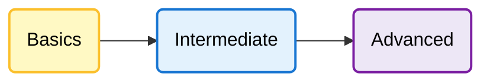

# Learning Javascript - #4


> **Documentation of the Javascript learning journey.**

This repository contains a collection of practice codes, notes, and mini-projects arranged systematically to understand modern **JavaScript**, from the fundamentals to more advanced concepts.

---

## 📚 Learning Resources

All materials and exercises in this repository are learned and developed based on the **JavaScript** playlist from **Web Programming Unpas** YouTube channel.

🎥 **Main Reference:** [YouTube Web Programming Unpas](https://www.youtube.com/@sandhikagalihWPU)

---

## 🗺️ Learning Roadmap

Here is the recommended learning path followed in this repository:

1. 🟢 **Basics**

   * JavaScript syntax, variables, operators, popup boxes, loops, branching, functions, arrays, and objects.
2. 🔵 **Intermediate**

   * DOM manipulation, events, callbacks, higher-order functions, asynchronous JavaScript, and API interaction.
3. 🟣 **Advanced**

   * ES6+, modules, promises, async/await, object-oriented programming, and advanced JavaScript patterns.



---

## 📂 Folder Structure

Each folder contains JavaScript practice files separated by learning level:

```text
learningJavascript/
│
├── Basics
│   ├── latihan1-code
│   ├── latihan2-popup box
│   ├── latihan3-looping while
│   ├── latihan4-looping for
│   ├── latihan5-branching if else
│   ├── latihan6-branching switch
│   ├── latihan7-nested loop
│   ├── latihan8-javaSuit
│   ├── latihan9-function
│   ├── latihan10-refactoring
│   ├── latihan11-variable scope
│   ├── latihan12-recursion
│   ├── latihan13-array
│   └── latihan14-object
│
├── Intermediate
│   ├── ...
│   └──
│
├── Advanced
│   ├── ...
│   └──
│
├── .gitignore
├── LICENSE
└── README.md
```

---

## 🚀 Getting Started

To use this repository on your local machine, follow these steps:

1. **Clone the repository**
   Open your terminal and run the following command:

   ```bash
   git clone https://github.com/siocongs/learningJavascript.git
   ```

2. **Navigate to the project directory**

   ```bash
   cd learningJavascript
   ```

3. **Open in Text Editor/IDE (VSCode/Cursor)**

   ```bash
   code .
   ```

4. **Start Learning**

   Open any exercise folder (for example, `Basics/latihan9-function`) and run the `index.html` file in your browser.

---

## 🤝 Want to Contribute?

This repository is intended as a **personal learning archive**, but suggestions and corrections are always open!

* Found a bug? Open an **Issue**.
* Want to improve the code or documentation? Submit a **Pull Request**.
